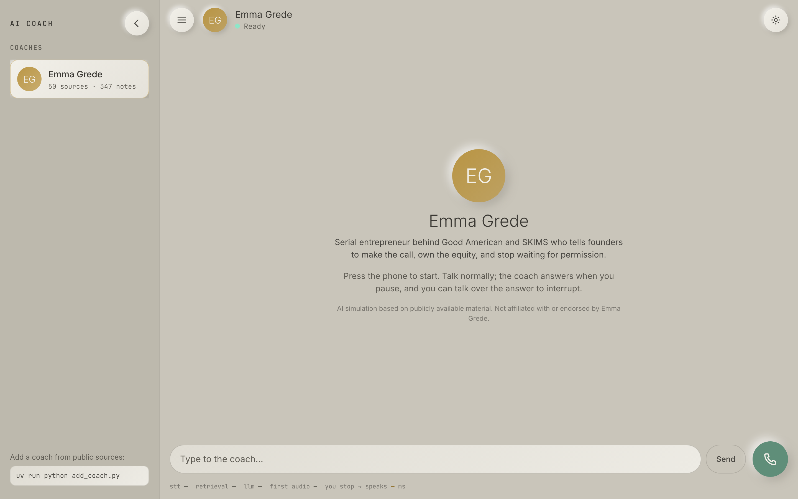

# AI Coach

Talk to an AI coach built from a real person's **publicly expressed** ideas, in a low-latency voice
call that runs on your Mac. Speech recognition, turn-taking, voice cloning and the knowledge base
are all local; only the text of the conversation goes to the language model.



> AI simulation based on publicly available material. Not affiliated with or endorsed by the person
> represented. Generated speech is never presented as a real quotation.

## Quick start (Apple Silicon)

```bash
git clone https://github.com/jenniedov/ai-coach.git && cd ai-coach
./setup.sh                      # uv + Python 3.12 env, dependencies, ~3.2 GB of local speech models
# put an LLM key in .env:   XAI_API_KEY=...   or   GROQ_API_KEY=...   (Groq has a free tier)
./start.sh                      # -> http://localhost:3000
```

The repo ships a generic example coach so it runs out of the box; build a real one from public sources with `add_coach.py` (below). Open it in Chrome, press the phone button, allow the microphone, and talk. The coach answers when
you pause; talk over it to interrupt; press **M** or the mute button to stop it hearing the room.
You can also type instead of speaking.

## How it works

```
mic ──WebRTC──▶ Silero VAD ▶ Smart Turn v3 ▶ Parakeet STT ▶ knowledge retrieval ▶ LLM ▶ TTS ──WebRTC──▶ speaker
                └──────────────────── Pipecat pipeline (interruptions, sentence chunking, metrics) ────────────────┘
```

| Stage | Component | Where |
|---|---|---|
| Transport | WebRTC (Opus), browser echo cancellation | local |
| Voice activity / end of turn | Silero VAD + Smart Turn v3.2 (semantic), or a fixed pause | local |
| Speech-to-text | Parakeet TDT 0.6B v3 on MLX (fallback: Whisper-small MLX) | local |
| Knowledge retrieval | BM25 + bge-small embeddings over `coaches/<id>/knowledge` | local |
| Language model | xAI Grok (`grok-4.3`), Groq (`gpt-oss-120b`), OpenAI, or Ollama; model list read from your account | remote (Ollama: local) |
| Text-to-speech | Breeze TTS 2 (best clone, heavy) · Pocket TTS (clone, light) · Kokoro-82M (fastest) · macOS `say` | local |
| Conversation engine | [Pipecat](https://github.com/pipecat-ai/pipecat) | local |

## Speech engines

| Engine | Voice clone | 5 s sentence on an M1 Pro | Use it when |
|---|---|---|---|
| **Breeze TTS 2** (MLX 4-bit) | yes | ~12 s | you want the best voice and have a strong Mac (M3 Max and up feel live) |
| **Pocket TTS** (MLX) | yes | ~0.75 s, streams | any Apple Silicon Mac |
| **Kokoro-82M** (MLX) | no, stock voices | ~0.4 s | you just want it fast |
| macOS `say` | no | instant | nothing else works |

If a Breeze call gets stuck or the coach pauses for many seconds between sentences, the computer is
not strong enough for it: end the call and pick Pocket TTS in Settings. The app shows this notice
itself.

## Measured on an M1 Pro (16 GB)

| Metric | Value |
|---|---|
| Speech-to-text, 5 s utterance | 100–300 ms |
| End-of-turn decision | Smart Turn ~0.3 s when confident, fallback 1.0 s; pause mode 0.65 s |
| Retrieval | 5–15 ms |
| LLM first token (Groq gpt-oss-120b) | 0.3–0.7 s |
| **You stop talking → coach speaks** | ≈ 2–3 s (Pocket / Kokoro), typed turn ≈ 1.2 s |

`scripts/e2e_call.py` places a real WebRTC call with a synthesized question and prints these numbers;
the app shows them under the composer.

## Project layout

```
server/            FastAPI + Pipecat bot (bot.py: VAD → STT → RAG → LLM → TTS, barge-in, latency)
  llm/             OpenAI-compatible streaming provider (xai | groq | openai | ollama)
  stt/  tts/       Parakeet / Whisper; Breeze / Pocket / Kokoro / say; consent-gated custom voices
  coach/           loader, hybrid retrieval, prompt assembly
coaches/           example_coach/ (placeholder); your own coaches are git-ignored — see coaches/README.md
voices/            custom voices (voice.json + reference.wav) — see voices/README.md
web/               the UI (vanilla JS, Warm Neumorphic design system)
scripts/           e2e_call.py · add_voice.py · download_models.py
add_coach.py       research + build a new coach from URLs
tests/             pytest (unit, plus integration when the server is running)
```

## Add a coach

```bash
uv run python add_coach.py      # prompts: Name, Website, YouTube URLs, Podcast URLs, Other sources
```

It fetches the pages and transcripts, has the LLM extract evidence-tagged claims per source, and
writes `coaches/<id>/`. Restart the server and the coach appears in the sidebar. Review the output
before relying on it; it is a first draft. Coaches you build stay local (git-ignored).

## Add a voice

```bash
uv run python scripts/add_voice.py --name "My voice" --id my_voice --sample ~/clip.m4a \
    --start 3 --duration 12 --i-have-permission --consent "my own voice"
```

Only clone voices you have permission to use; a voice without a consent note is ignored. Reference
audio never leaves the machine and is git-ignored.

## Settings (`.env`)

`LLM_PROVIDER` (auto|xai|groq|openai|ollama), `LLM_MODEL`, `TTS_ENGINE`, `TTS_VOICE`, `TURN_MODE`
(smart|silence), `VAD_THRESHOLD` (raise in noisy rooms), `VAD_MIN_VOLUME`, `BARGE_IN_ENABLED`,
`LLM_MAX_TOKENS`. See `.env.example`.

## Tests

```bash
uv run pytest -q
uv run python scripts/e2e_call.py                       # spoken question, prints latency
uv run python scripts/e2e_call.py --barge-in-after 1.5  # interruption test
```

## Limitations

- Breeze TTS 2 needs a strong Mac to feel live; on an M1 Pro it is ~2.4× slower than real time.
- Parakeet v3 is English-first; set `STT_ENGINE=whisper` for other languages.
- Barge-in relies on the browser's echo cancellation; headphones make it rock solid.
- The knowledge base is public material only; where it has no position the coach extrapolates from
  its stated principles and says so.

## License

MIT for the code in this repository. Models keep their own licenses (Breeze TTS 2 is non-commercial).
